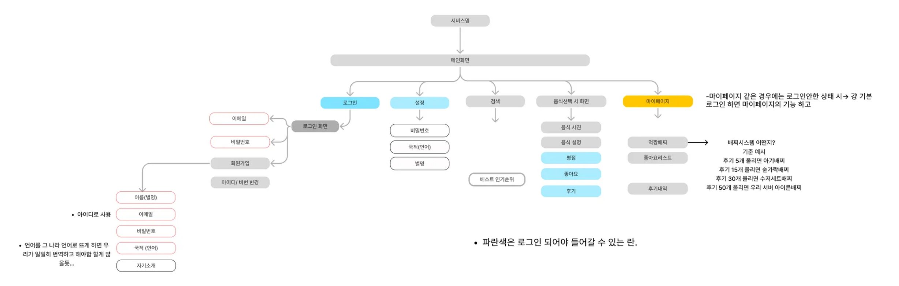

## 👋 박주용 (Parkjuyong)
### 소프트웨어학과 2022301304 **박주용**입니다.

## 📫 연락처
**Phone** : 010-7738-7812 

**GitHub** : [pjuyong](https://github.com/pjuyong)

**E-mail** : imjuyongp@skuniv.ac.kr

## 🎯 Git Convention

- 🎉 **Start:** Start New Project [:tada:]
- ✨ **Feat:** 새로운 기능을 추가 [:sparkles:]
- 🐛 **Fix:** 버그 수정 [:bug:]
- 🎨 **Design:** CSS 등 사용자 UI 디자인 변경 [:art:]
- ♻️ **Refactor:** 코드 리팩토링 [:recycle:]
- 🔧 **Settings:** Changing configuration files [:wrench:]
- 🗃️ **Comment:** 필요한 주석 추가 및 변경 [:card_file_box:]
- ➕ **Dependency/Plugin:** Add a dependency/plugin [:heavy_plus_sign:]
- 📝 **Docs:** 문서 수정 [:memo:]
- 🔀 **Merge:** Merge branches [:twisted_rightwards_arrows:]
- 🚀 **Deploy:** Deploying stuff [:rocket:]
- 🚚 **Rename:** 파일 혹은 폴더명을 수정하거나 옮기는 작업만인 경우 [:truck:]
- 🔥 **Remove:** 파일을 삭제하는 작업만 수행한 경우 [:fire:]
- ⏪️ **Revert:** 전 버전으로 롤백 [:rewind:]

---
## 외국인들을 위한 음식 맵기 비교 서비스 IA
