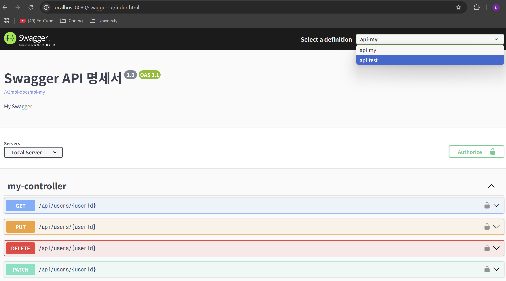

# 🎉 3주차 과제

## ➡️ **API 명세서**

API 명세서란 API의 동작 방식, EndPoint, 요청 및 응답 구조, 인증 방식 등 특정 **API들의 설명**을 작성한 것
목적

- **명확한 소통** : 개발 및 협업 과정에서 명세서를 통한 원활하고 명확한 소통을 할 수 있음.
- **일관성 유지** : 명세서를 통한 API 및 개발 일관성 유지 가능.
- **효율적인 유지보수** : 코드 수정, API 수정시 명세서를 통해 쉽게 유지보수 및 확장 가능

### ✅️ **명세서에 포함되는 정보**

1. **Request Header** : 전송 관련 기타 정보를 담음(인증 방식 등)
2. **Request body** : 실제 데이터 예시 코드를 담음(어떤 데이터가 통신 되는지)
3. **API EndPoint** : 어떤 URI 경로를 통해서 데이터가 통신 되는지
4. **HTTP Method** : 어떤 방식을 통해서 데이터를 통신하는지
5. **PathVariable & QueryString** : 특정 식별값 또는 특정 식별값들에 대하여 데이터가 통신 되는지

## ➡️ **Json & Jackson 라이브러리**

- Json(JavascriptObjectNotation) : **자바스크립트에서 객체를 표현하는 방법**. 이는 다양한 프로그래밍 언어, 시스템에서 주고 받기 위하여 사용된다.
- Jackson 라이브러리  : 이러한 **자바스크립트 객체를 Java에서 받고, 내보내는 과정을 하기 위해서 사용**한다.

1. Java객체->Json 변환 : **데이터를 내보내는 직렬화**
2. Json->Java객체 변환 : **데이터를 받는 역직렬화**

## ➡️ **Swagger**

API 문서화 및 테스트를 돕는 오픈소스 프레임워크

- Swagger 사용

```java

@Configuration
public class SwaggerConfig {

    //지정된 환경 변수가 없다면 :(콜론) 이후 값을 default로 가지게 됨(없다면 localhost:8080)
    @Value("${server.servlet.context-path:}")
    private String contextPath; //Value 어노테이션을 통해서 환경변수 관리

    @Bean
    public OpenAPI customOpenAPI() {
        Server localServer = new Server(); //Server 객체 생성
        localServer.setUrl(contextPath); //url 지정
        localServer.setDescription("Local Server");

        return new OpenAPI()
            .addServersItem(localServer)
            .addSecurityItem(new SecurityRequirement().addList("bearerAuth"))
            .components(
                new Components()
                    .addSecuritySchemes(
                        "bearerAuth",
                        new SecurityScheme()
                            .type(SecurityScheme.Type.HTTP)
                            .scheme("bearer")
                            .bearerFormat("JWT")))
            .info(new Info().title("Swagger API 명세서").version("1.0").description("My Swagger"));
    }

    //Group(목록)OpenApi를 통한 Api 목록 생성
    @Bean
    public GroupedOpenApi customGroupedOpenApiTest() {
        return GroupedOpenApi.builder().group("api-test").pathsToMatch("/api/*-test").build();
    }

    @Bean
    public GroupedOpenApi customGroupedOpenApiUsers() {
        return GroupedOpenApi.builder().group("api-my").pathsToMatch("/api/users/**").build();
    }
}
```

- Swagger 사용 화면
  

## ➡️ **CRUD(in SpringBoot)**

CRUD란 Create, Read, Update, Delete 네 단어의 약자로 데이터를 다루는 방법을 의미.

- Create(in SpringBoot)

```java

@PostMapping("create-test") //실제로는 url에 create를 쓰는 것이 아님(Http 메서드로 구분)
public String createTest() {
    return "This is create test";
}
```

- Read(in SpringBoot)

```java

@GetMapping("read-test") // "
public String readTest() {
    return "This is read test";
}
```

- Update(in SpringBoot)

```java

@PatchMapping("update-test") // "
public String updatePatchTest() {
    return "This is update patch test";
}

@PutMapping("update-test") // "
public String updatePutTest() {
    return "This is update put test";
}
```

- Delete(in SpringBoot)

```java

@DeleteMapping("delete-test") // "
public String deleteTest() {
    return "This is delete test";
}
```

## ➡️ **Annotation**

- Annotation : 주석이라는 뜻으로 추가 설명,낱말이나 문장의 뜻을 쉽게 풀이할 때 사용한다
- **자바의 Annotation** : 특별한 기능을 수행하도록 하는 기술이다. 어노테이션을 통해서 소스코드에 **메타데이터**를 추가할 수 있다.

> - ⭐장점⭐
>1. **코드 가독성 향상** : 코드와 설정을 같은 위치에 배치하여 읽고 이해하기 쉬움
>2. **설정 간소화** : 별도의 설정없이 어노테이션만을 사용하여 간소화 가능
>3. **중복 코드 제거** : 공통적인 코드 패턴이나 설정 재사용 가능

### ☑️ **자주 사용하는 10가지 Annotation**

1. **@RestController**

- @Controller + @ResponseBody 합친 것
- 메서드의 반환 값을 Json 형태로 직접 보낸다.

```java

@RestController
@RequestMapping("api")
public class HttpMethodController {
    // api
}
```

2. **@RequestMapping**

- URL 경로와 HTTP 메서드를 매핑시킨다.
- 클래스와 메서드 둘 다 붙일 수 있다.

```java

@RestController
@RequestMapping("api") //클래스에 사용
public class HttpMethodController {

    @RequestMapping("test") //메서드에 사용(Get, Post 모두 허용)
    public String Test() {
        return "This is create & Read test";
    }
}
```

3. **@Controller**

- 주로 HTML 화면(View)을 반환할 때 사용
- 템플릿 엔진(Thymeleaf 등)과 함께 사용

```java

@Controller
public class ViewController {

    @GetMapping("/page")
    public String page() {
        return "pageView"; // templates/pageView.html 렌더링
    }
}
```

4. **@PathVariable**

- URL 경로의 일부({변수} 형태로 지정된 것)를 변수로 받아온다.

```java

@RestController
public class UserController {

    @GetMapping("/users/{id}")
    public String getUser(@PathVariable Long id) {
        return "User ID: " + id;
    }
}
```

5. **@RequestParam**

- QueryString 또는 FormData 값을 파라미터로 받아온다.

```java

@RestController
public class SearchController {

    @GetMapping("/search")
    public String search(@RequestParam String keyword) {
        return "Search Keyword: " + keyword;
    }
}
```
💡/search?keyword=spring 요청 시 "Search Keyword: spring" 반환

6. **@RequestBody**

- HTTP 본문(body)의 Json 데이터를 **자바 객체로 변환** 해준다.

```java

@RestController
public class MemberController {

    @PostMapping("/members")
    public String createMember(@RequestBody Member member) {
        return "Saved: " + member.getName();
    }
}

class Member {

    private String name;
    // getter, setter
}
```

7. **@ResponseBody**

- 메서드의 반환값을 HTTP 응답 본문으로 직접 보낼 수 있게한다.

```java

@Controller
public class SimpleController {

    @GetMapping("/text")
    @ResponseBody
    public String text() {
        return "Plain text response";
    }
}
```

💡브라우저에 Plain text response가 나옴.

8. **@Entity**

- 이 클래스가 JPA에서 관리하는 테이블임을 의미

```java

@Entity
public class Product {

    private String name;
    private int price;
}
```

9. **@Id, @GeneratedValue**

- DB 테이블 생성시, PrimaryKey로 지정한 컬럼에 두 어노테이션을 붙여
  JPA가 인식할 수 있게 해줌.

```java

@Entity
public class User {

    @Id
    @GeneratedValue
    private Long id; // 자동 증가 ID

    private String name;
    //나머지 필드
}
```

10. **⭐@Transactional⭐**

- 해당 메서드나, 클래스에서 실행되는 작업은 하나의 **트랜잭션**으로 묶음
- 성공시 -> commit, 실패시 -> rollback

즉 중간에 문제가 발생하면, DB에 아무것도 반영하지 않게 해줌.

> 예를 들어 하나의 통장에 **1000원이 남아 있을 때**, **동시에 서로 다른 ATM기에서 출금 시도**시
> 한 쪽에서만 될 수 있게 해준다. (서로 다른 출금을 하나의 트랜잭션 범주내에서 일어나는 메서드로 인식)

🔥트랜잭션이 보장하는 4대 특성🔥

- **Atomicity** : 데이터 원자성 (모두 성공 또는 모두 실패해야함)
- **Consistency** : 데이터 일관성 (데이터 규칙이 항상 유지돼야함)
- **Isolation** : 데이터 고립성 (동시에 작업해도 서로 간섭하지 않아야함)
- **Durability** : 데이터 지속성 (한 번 커밋되면 영구 저장돼야함)
