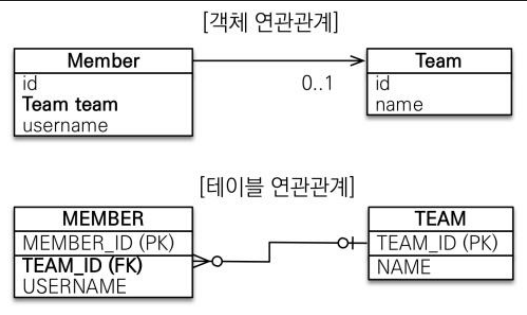
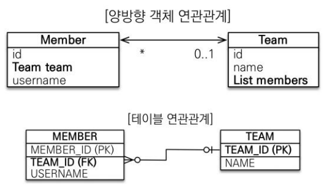

# 📌연관 관계

- 객체 지향 프로그래밍 : 하나의 객체가 다른 객체를 참조하여 연관
- 관계형 데이터베이스 : 하나의 테이블이 다른 테이블의 외래키 값으로 연관됨

관계 표현 방식이 달라 자연스러운 매핑 필요 -> ORM 기술 사용(JPA)

# ➡️ 방향

- 객체 지향 프로그래밍 : 참조용 필드가 있는 쪽으로만 참조 가능(단방향, 양방향 나누어짐)
- 관계형 데이터베이스 : 외래키로 연관되어 방향 개념이 없음

## ☑️단방향 연관 관계



## ☑️양방향 연관 관계



### 💡연관 관계의 주인

위 예시처럼 양방향 연관 관계에서 <객체지향 프로그래밍>관점에서 객체의 참조는(서로 하므로) 두 개이지만, 실제 **<테이블>**에서
참조하는 외래키는 하나가 됨.
따라서 테이블의 외래키를 관리하는 ⭐**주인**⭐이 필요함.

- 주인 : 외래키 관리 가능, mappedBy 사용x, 1:N에서 N측이 외래키 가짐
- 주인 아닌 쪽 : 읽기만 가능, mappedBy 사용o

### 💡다중성

객체, 테이블간에 1:1, 1:N, N:M 관계가 존재

⚠️주의 :
객체지향 프로그래밍에서는 다대다 관계가 표현 가능하지만, RDB에서는 2개의 테이블로 다대다 관계 표현 불가.
따라서 중간 테이블을 만들어 1:N, N:1 관계로 풀어내야 함.

## ➡️ Fetch Type

정의 : JPA에서 엔티티 조회시 연관된 엔티티를 조회하는 방법을 결정하는 전략. 두 가지로 나누어짐

1. 즉시 로딩(EAGER) : 엔티티 조회시 기본적으로 연관된 엔티티도 함께 조회(쿼리 복잡성 증가, 성능 문제 발생)
2. 지연 로딩(LAZY) : 관련된 엔티티가 실제 사용될 때 조회(불필요한 데이터 조회 방지, 성능에 유리)

⚠️주의 :
따로 설정해주지 않는다면 기본값은 즉시 로딩이기 때문에 LAZY로 설정해줘야함!

## ➡️Cascade

정의 : 부모 엔티티에서 자식 엔티티에게 영속성 작업을 전이하는 설정(부모 엔티티 변경시 연관된 자식 엔티티도 함께 처리)
목적 : 연관 객체를 일일이 관리하지 않아도 되므로 코드 간결화 및 유지보수성 높아짐.

- Cascade Type 종류

1. ALL : 모든 영속성 전이
2. PERSIST : 부모 엔티티 저장시 자식도 저장
3. MERGE : 부모 엔티티 병합시 자식도 병합
4. REMOVE : 부모 엔티티 삭제시 자식도 삭제
5. REFRESH : 부모 엔티티 재조회시 자식도 새로고침
6. DETACH : 부모 엔티티를 영속성 컨텐스트에서 분리시 자식도 분리

- 예시 코드

```java

import java.util.ArrayList;

@OneToMany(mappedBy = "team", cascade = CascadeType.ALL, orphanRemoval = true)
private List<Member> members = new ArrayList<>();
//orphanRemoval이란 부모 엔티티와 연관 관계가 끊어진 자식 엔티티(고아 객체)를 DB에서 자동 삭제 옵션
```

# 📌 ERD 작성시 주의해야 할 제약조건

1. 개체 무결성 제약 조건 : 기본키는 NULL이 될 수 없음(기본키로 개체를 구분하기 때문)
2. 참조 무결성 제약 조건 : 외래키는 참조하는 기본키가 존재해야 함(외래키는 NULL이 될 수는 있음)
3. 도메인 제약 조건 : 각 속성의 데이터 타입 및 값의 범위를 제한하는 제약
4. 고유성 제약 조건 : (기본키가 아닌) 속성값이 중복될 수 없는경우에 사용. ex) 주민등록번호,이메일 등
5. NULL 제약 조건 : 특정 속성에 반드시 값이 있어야함(erdcloud에서는 Not NULL, NULL로 설정 가능)