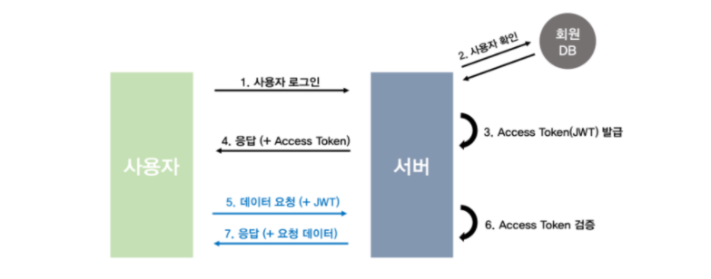

# 🎉9주차 과제

## ✅JWT

Json Web Token의 약자로, Json 형식의 데이터를 기반으로 생성된, 서명된 토큰

JWT는 총 3개의 부분으로 구성된 문자열 토큰!

xxxxx.yyyyy.zzzzz

1. x : **Header** 부분으로, 토큰 타입(Jwt)과 서명 알고리즘(HS256 등) 정보가 담겨있음
2. y : **Payload** 부분으로, 사용자 정보, 권한, 만료시간 같은 클레임 정보가 담겨있음 (전달하려논 정보)
3. z : **Signature** 부분으로, 위 Header와 Payload를 기반으로 서버만 알고 있는 비밀키(Secret key)를 통해 서명한 값

### ➡️JWT 동작 원리

## ✅AccessToken

로그인 성공 후 발급되는 (Jwt형식의) 토큰으로, 클라이언트가 서버에 요청을 보낼 때 자신의 인증 상태를 증명하기 위해 사용

1. 유효기간 짧음(5~30분)
2. 서버는 이 토큰을 검증만하고, 상태 저장x (Stateless)
3. 사용자 API 호출 시 토큰을 헤더 정보에 담아 보냄

- 로컬 스토리지보다 **Memory / Secure Cookie 사용 권장**

## ✅RefreshToken

AccessToken이 만료됐을 때 새로운 AccessToken을 재발급받기 위한 (Jwt형식의) 토큰

1. 유효기간 김(7일~30일)
2. DB 또는 Redis 등 서버에 저장해 관리
3. 일반적으로 요청 헤더가 아닌 쿠키 또는 보안 저장소에 보관

### 📌AccessToken vs RefreshToken

| 구분    | Access Token                | Refresh Token            |
|-------|-----------------------------|--------------------------|
| 목적    | API 요청 시 인증용                | Access Token 재발급용        |
| 저장 방식 | 클라이언트에서만 보관 (로컬스토리지, 메모리 등) | 보안 위해 서버에 저장             |
| 유효기간  | 짧음 (분 단위)                   | 김 (일 또는 주 단위)            |
| 사용 위치 | HTTP 요청 헤더에 담김              | 보통 쿠키 또는 body/헤더         |
| 보안 위험 | 탈취 시 권한 남용 우려 ↑             | 탈취 시 토큰 재발급 가능성 ↑ (더 위험) |
| 검증 방식 | JWT 서명 검증                   | DB에서 직접 조회               |

- Access Token은 **Memory / Secure Cookie 사용 권장**
- Refresh Token은 **HTTP-Only 설정 및 Secure 쿠키에 저장**
- **로그아웃 시** Refresh Token 탈취를 막기 위해 **DB에서 삭제**, AccessToken은 **블랙리스트** 저장

## ➡️동작 흐름

1. 사용자 로그인 -> AccessToken + Refresh Token 발급
2. 클라이언트가 API 요청 시 AccessToken 을 헤더 정보에 포함하여 요청
3. 만료된 AccessToken으로 요청 시, 새 AccessToken 요청 -> 서버는 RefreshToken 값을 비교하여 응답
4. RefreshToken도 만료되었거나 유효하지 않으면 재로그인